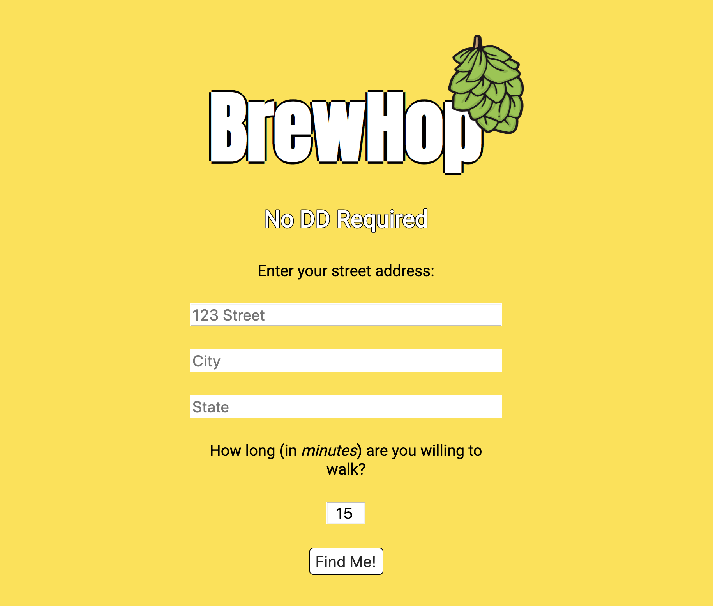
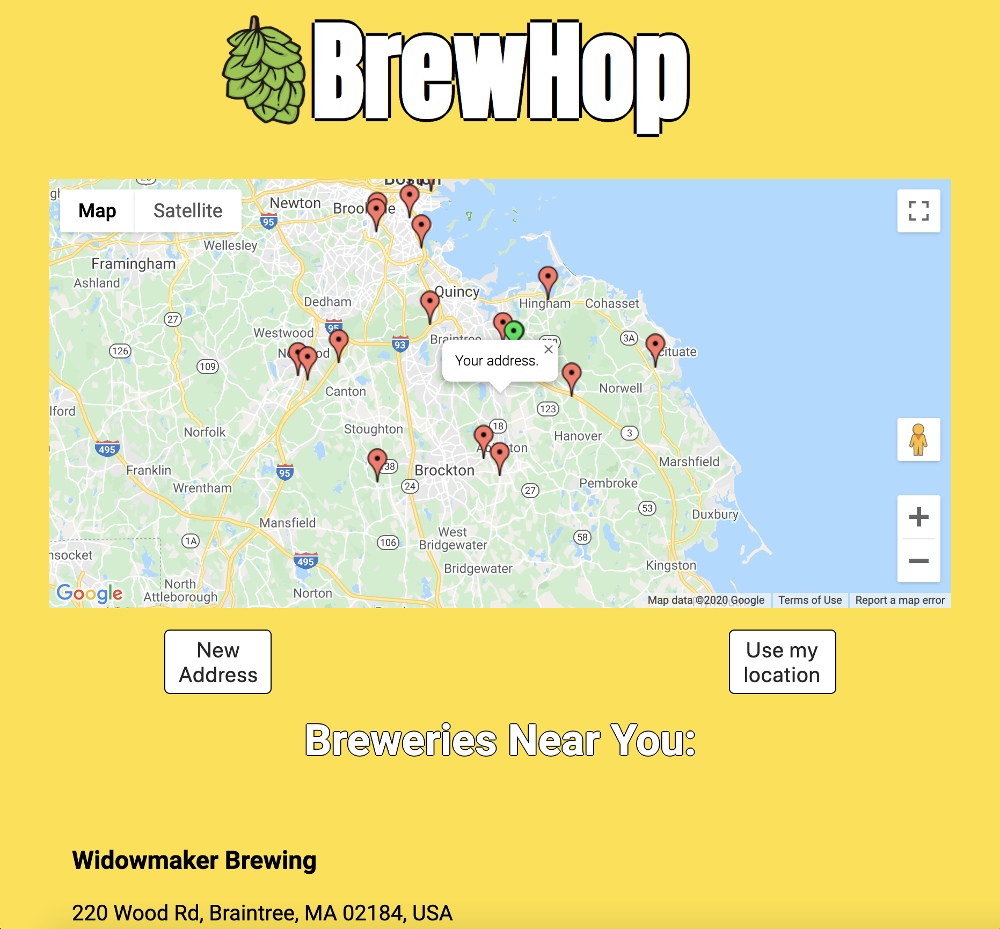

<!-- # BrewHop-->
# BrewHop

A tool to find breweries within walking distance of a user for a fun, safe afternoon of brewery hopping.

## Motivation

You likely want to try a variety of beers whenever you plan a brewery visit. That can make driving dicey, and potentially ILLEGAL
depending on consumption. The next best alternatives are to get a DD, use public transportation, or WALK. Why not burn some of those 
heavy empty calories while you're at it? Even better, once you know if/which breweries are within walking distance, why not make an 
afternoon out of it and BREWERY HOP?

## Build Status

Version 1.0 calculates distances to breweries and displays basic, need to know information for decision-making.
Breweries within walking distance (determined by time/minutes) are plotted on a map with GREEN markers.

## Screenshots
Landing Page/Search Criteria:

Results Screen:

## Built With

### Front-End
* HTML
* CSS
* Javascript
* Google Maps Geocode API
* Google Maps Javascript API
* Google Maps Javascript API Places & Distance Matrix Libraries

## Features

* Search by address or geolocation on map load
* Return green markers for walkable breweries
* Return basic brewery information
* Reset map using geolocation

## Upcoming features

* Choose a workout - Light, Medium, Heavy & return corresponding colored markers
* Calculate distances from public transportation
* Integrate advanced brewery information - tap list, beer styles, ratings

## Notes

Untapped API would have been ideal to integrate user ratings and detailed brewery/beer information,
but requires formal submission of a request for an API Key and an existing app. RateBeer API likewise 
requires an application and a several week approval period. Perhaps in a future version!

## Demo

- [Live Demo](https://steviereyjuan.github.io/BrewHop/)

## Authors

* **S. Reyes** - Front-End Development

## Acknowledgments

* **Walter Guevara** - My mentor and a source of inspiration for where to take this project next